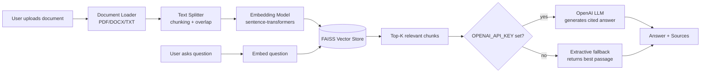

# 📄 RAG-Based AI Document Intelligence & Question Answering System

A full-stack **Retrieval-Augmented Generation (RAG)** system that lets you upload documents
(PDF, DOCX, TXT, MD) and ask natural-language questions about their contents — with cited
source passages, a REST API, a web UI, Docker support, and automated tests.

Runs **completely free and offline** out of the box (local embeddings + local extractive
answering). Add an OpenAI API key to upgrade to fully synthesized LLM answers.

---

## ✨ Features

- **Multi-format ingestion** — PDF, DOCX, TXT, and Markdown documents
- **Semantic chunking** with configurable size/overlap and paragraph-aware splitting
- **Local embeddings** via `sentence-transformers` (no API key required)
- **Fast vector search** via FAISS (cosine similarity)
- **Two answer generation modes**:
  - `openai` — real LLM-synthesized answers with inline citations (when `OPENAI_API_KEY` is set)
  - `extractive` — free, local fallback that returns the most relevant passage directly
- **REST API** built with FastAPI (auto-generated OpenAPI docs at `/docs`)
- **Web UI** built with Streamlit — upload docs, ask questions, inspect sources
- **Document management** — list and delete indexed documents
- **Persistent vector store** — survives restarts, stored on disk
- **Dockerized** — one command to run backend + frontend
- **Unit + API tests** with `pytest`

## 🏗️ Architecture



## 📁 Project Structure

```
rag-document-qa/
├── app/
│   ├── main.py              # FastAPI app & routes
│   ├── config.py            # Settings (env-driven)
│   ├── models.py            # Pydantic request/response schemas
│   ├── document_loader.py   # PDF/DOCX/TXT text extraction
│   ├── text_splitter.py     # Chunking logic
│   ├── embeddings.py        # sentence-transformers wrapper
│   ├── vector_store.py      # FAISS index + persistence
│   └── rag_pipeline.py      # Orchestrates ingestion & Q&A
├── frontend/
│   └── streamlit_app.py     # Web UI
├── scripts/
│   └── ingest.py            # CLI batch ingestion
├── tests/
│   └── test_api.py          # Unit + API tests
├── data/
│   ├── uploads/              # Uploaded files (gitignored)
│   └── vectorstore/           # FAISS index + metadata (gitignored)
├── requirements.txt
├── .env.example
├── Dockerfile
├── docker-compose.yml
└── README.md
```

## 🚀 Quickstart (local, no Docker)

```bash
# 1. Clone and enter the repo
git clone <your-repo-url>
cd rag-document-qa

# 2. Create a virtual environment
python -m venv venv
source venv/bin/activate      # Windows: venv\Scripts\activate

# 3. Install dependencies
pip install -r requirements.txt

# 4. Configure environment
cp .env.example .env
# (optional) add OPENAI_API_KEY in .env for real LLM answers

# 5. Start the API
uvicorn app.main:app --reload --port 8000
# API docs: http://localhost:8000/docs

# 6. In a second terminal, start the UI
streamlit run frontend/streamlit_app.py
# UI: http://localhost:8501
```

## 🐳 Quickstart (Docker)

```bash
cp .env.example .env
docker compose up --build
```

- Backend: http://localhost:8000/docs
- Frontend: http://localhost:8501

## 🔌 API Reference

| Method | Endpoint                  | Description                          |
|--------|----------------------------|---------------------------------------|
| GET    | `/health`                  | Service status + index stats          |
| POST   | `/documents/upload`        | Upload & index a document (multipart) |
| GET    | `/documents`                | List indexed documents                |
| DELETE | `/documents/{document_id}` | Remove a document from the index      |
| POST   | `/query`                    | Ask a question                        |

**Example: upload a document**
```bash
curl -X POST http://localhost:8000/documents/upload \
  -F "file=@./my_report.pdf"
```

**Example: ask a question**
```bash
curl -X POST http://localhost:8000/query \
  -H "Content-Type: application/json" \
  -d '{"question": "What were the key findings in Q3?"}'
```

**Example response**
```json
{
  "answer": "The Q3 report highlights a 12% increase in revenue [Source 1]...",
  "sources": [
    {
      "document_id": "a1b2c3d4",
      "filename": "my_report.pdf",
      "chunk_index": 3,
      "text": "Revenue grew 12% year-over-year...",
      "score": 0.87
    }
  ],
  "mode": "openai"
}
```

## ⚙️ Configuration

All configuration lives in `.env` (see `.env.example`):

| Variable            | Default              | Description                                   |
|---------------------|----------------------|------------------------------------------------|
| `OPENAI_API_KEY`    | *(empty)*            | If set, enables LLM-generated answers          |
| `OPENAI_MODEL`      | `gpt-4o-mini`         | Chat model used for generation                 |
| `EMBEDDING_MODEL`   | `all-MiniLM-L6-v2`   | Any sentence-transformers model                |
| `CHUNK_SIZE`        | `800`                | Max characters per chunk                       |
| `CHUNK_OVERLAP`     | `120`                 | Overlap between consecutive chunks             |
| `TOP_K`             | `4`                   | Number of chunks retrieved per question        |
| `VECTOR_STORE_DIR`  | `./data/vectorstore` | Where the FAISS index is persisted             |
| `UPLOAD_DIR`        | `./data/uploads`      | Where uploaded source files are stored         |

## 🧪 Testing

```bash
pytest -v
```

Covers text chunking edge cases, vector store add/search/delete/persistence,
and end-to-end API upload + query flows.

## 🛣️ Possible Extensions

These are natural next steps if you want to extend this project further:

- Swap FAISS for a managed vector DB (Pinecone, Weaviate, Qdrant, pgvector)
- Add hybrid search (BM25 keyword + semantic) for better recall
- Add authentication and per-user document isolation
- Stream LLM responses token-by-token to the UI
- Add re-ranking (cross-encoder) after initial retrieval
- Support OCR for scanned/image-based PDFs

## 🧠 How This Maps to a Resume Bullet

> Built a full-stack RAG (Retrieval-Augmented Generation) document Q&A system using
> FastAPI, FAISS, and sentence-transformers, with a Streamlit UI, Dockerized deployment,
> automated test suite, and pluggable LLM backend (OpenAI) with a fully offline fallback mode.

## 📜 License

MIT — see [LICENSE](LICENSE).
